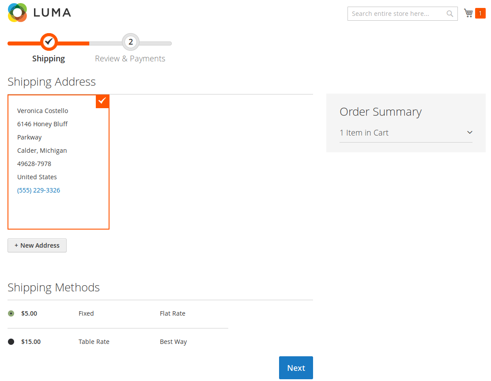
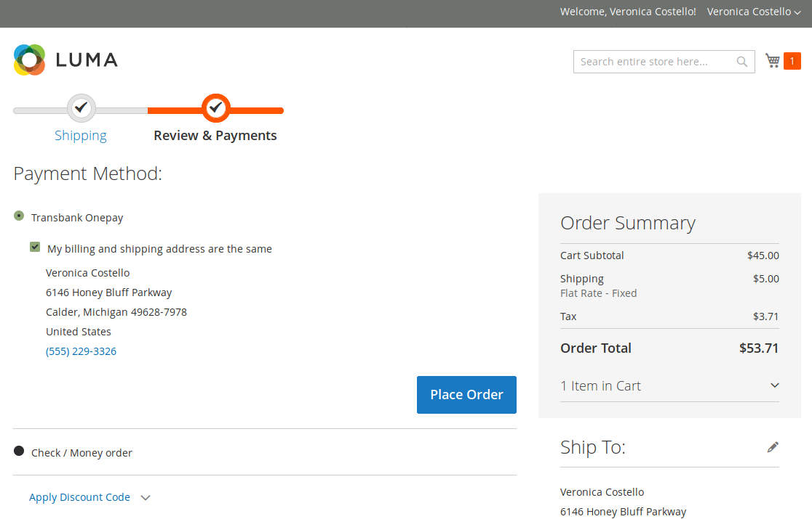
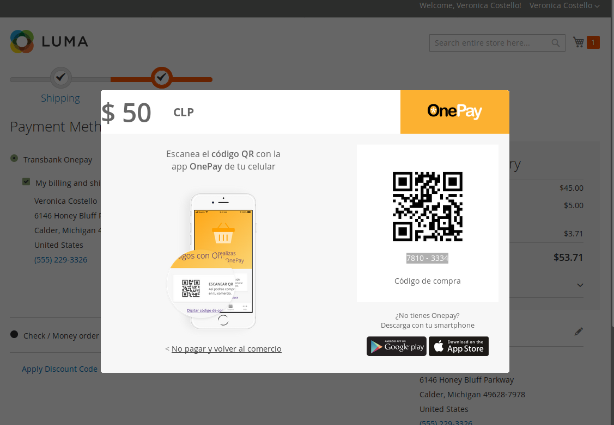
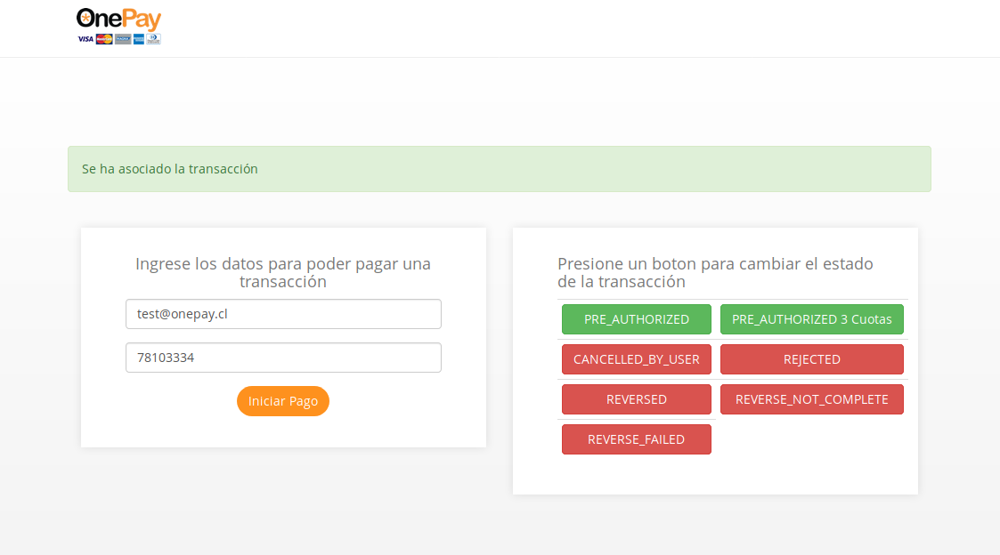
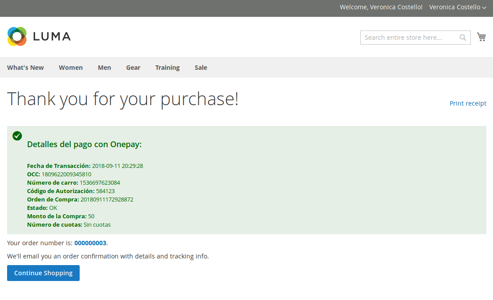
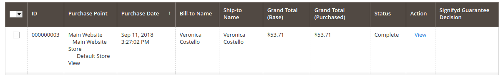
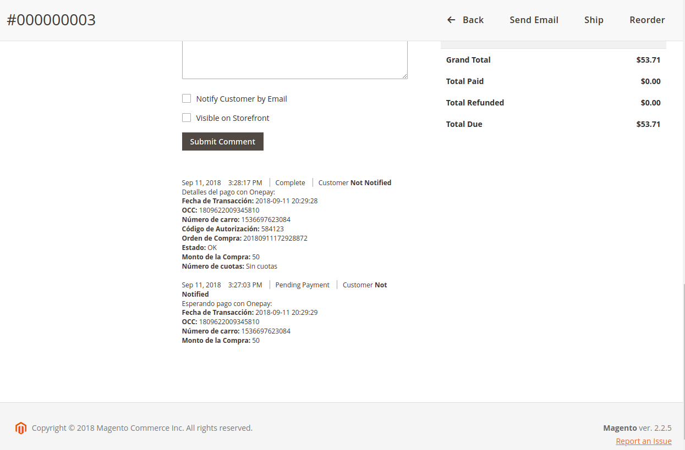

# Manual de instalación para Plugin Magento2

## Descripción

Este plugin oficial ha sido creado para que puedas integrar Onepay fácilmente en tu comercio, basado en Magento2.

## Requisitos

Ud. debe tener instalado previamente Magento2 o usar esta guia para instalar uno basado en docker.

Además debe crear una cuenta en Magento Marketplace siguiendo este tutorial oficial: [https://devdocs.magento.com/guides/v2.2/install-gde/prereq/connect-auth.html](https://devdocs.magento.com/guides/v2.2/install-gde/prereq/connect-auth.html)

Luego de crear la cuenta y crear la llave de acceso debe respaldar "Public Key" y "Private Key" dado que pueden ser requeridas durante el proceso de instalación de magento2.

## Instalación de la imagen docker de Magento2 para probar el plugin

1. Diríjase a [https://github.com/TransbankDevelopers/transbank-plugin-magento2-onepay-example](https://github.com/TransbankDevelopers/transbank-plugin-magento2-onepay-example) y clone el repositorio.

  Una vez clonado el repositorio puede seguir el README o seguir esta guia para proceder con la instalación de Magento2.

  Ingrese a la carpeta "transbank-plugin-magento2-onepay-example" y ejecute el comando:

    ./init

  

  

  Cuando finalice, ejecutar el comando:

    ./shell

  

  Al ingresar al contenedor, ejecutar el comando (Si el proceso de instalación pide autenticarse ingrese como username el valor de su "Public key" y como password el valor de su "Private Key" obtenidos anteriormente):

    install-magento2

  

  Cuando finalice, ejecutar los comandos:

    magento sampledata:deploy && magento setup:upgrade && magento setup:di:compile && magento setup:static-content:deploy

  

  Con esto se ha instalado Magento2 y ya puede ser usado

    - Sitio: http://localhost
    - Admin: http://localhost/admin
      - usuario: admin
      - clave: admin123

## Instalación del Plugin

1. Diríjase a [https://github.com/TransbankDevelopers/transbank-plugin-magento2-onepay](https://github.com/TransbankDevelopers/transbank-plugin-magento2-onepay) para ver el repositorio del plugin.

  Solamente si ha salido del contenedor, ejecutar el comando:

    ./shell

  

  Dentro del contenedor, ejecutar el comando:

    composer config repositories.transbankonepay vcs https://github.com/TransbankDevelopers/transbank-plugin-magento2-onepay.git

  

  Cuando finalice, ejecutar el comando:

    composer require transbank/onepay:dev-master 

  

  Cuando finalice, ejecutar el comando:

    magento module:enable Transbank_Onepay --clear-static-content

  

  Cuando finalice, ejecutar el comando:

    magento setup:upgrade && magento setup:di:compile && magento setup:static-content:deploy

  
  
2. Una vez realizado el proceso anterior, Magento2 debe haber instalado el plugin Onepay. Cuando finalice, debe activar el plugin en el administrador de Magento2.

## Configuración

Este plugin posee un sitio de configuración que te permitirá ingresar credenciales que Transbank te otorgará, y además podrás generar un documento de diagnóstico en caso que Transbank te lo pida.

Para acceder a la configuración, debes seguir los siguientes pasos:

1. Dirígete a la página de administración de Magento2 (usualmente en http://misitio.com/admin, http://localhost/admin) e ingrese usuario y clave.

  
  
2. Dentro del sitio de administración dirigirse a (Stores / Configuration).

  

3. Luego a sección (Sales / Payments Methods).

  

4. Elejir país Chile

  

5. Bajando al listado de metodos de pagos verá OnePay

  

6. ¡Ya está! Estás en la pantalla de configuración del plugin, debes ingresar la siguiente información:
  * **Enable**: Al activarlo, Onepay estará disponible como medio de pago. Ten la precaución de que se encuentre marcada esta opción cuando quieras que los usuarios paguen con Onepay.
  * **Endpoint**: Ambiente hacia donde se realiza la transacción. 
  * **APIKey**: Es lo que te identifica como comercio.
  * **Shared Secret**: Llave secreta que te autoriza y valida a hacer transacciones.
  
  Las opciones disponibles para _Endpoint_ son: "Integración" para realizar pruebas y certificar la instalación con Transbank, y "Producción" para hacer transacciones reales una vez que Transbank ha aprobado el comercio. Dependiendo de cual Endpoint se ha seleccionado el plugin usará uno de los dos set de APIKey y Shared Secret según corresponda. 
  
### Credenciales de Prueba

Para el ambiente de Integración, puedes utilizar las siguientes credenciales para realizar pruebas:

* APIKey: `dKVhq1WGt_XapIYirTXNyUKoWTDFfxaEV63-O5jcsdw`
* Shared Secret: `?XW#WOLG##FBAGEAYSNQ5APD#JF@$AYZ`

7. Guardar los cambios presionando el botón [Save Config]

  

8. Además, puedes generar un documento de diagnóstico en caso que Transbank te lo pida. Para ello, haz click en "Generar PDF de Diagnóstico", y automáticamente se descargará dicho documento.

  

## Prueba de instalación con transacción

En ambiente de integración es posible realizar una prueba de transacción utilizando un emulador de pagos online.

* Ingrese al comercio, puede usar los datos de prueba

  - Email: roni_cost@example.com
  - Password: roni_cost3@example.com

  

* Ya con la sesión iniciada, ingrese a cualquier sección para agregar productos

  

* Agregue al carro de compras un producto:

  

* Seleccione el carro de compras y luego presione el botón [Proceed to Checkout]:

  

* Seleccione método de envío y presione el botón [Next]

  

* Seleccione método de pago Transbank Onepay, luego precione el botón [Place Order]

  

* Una vez presionado el botón para iniciar la compra, se mostrará la ventana de pago Onepay, tal como se ve en la imagen. Toma nota del número que aparece como "Código de compra", ya que lo necesitarás para emular el pago en el siguiente paso:
  
  
  
* En otra ventana del navegador, ingresa al emulador de pagos desde [https://onepay.ionix.cl/mobile-payment-emulator/](https://onepay.ionix.cl/mobile-payment-emulator/), utiliza test@onepay.cl como correo electrónico, y el código de compra obtenido desde la pantalla anterior. Una vez ingresado los datos solicitados, presiona el botón "Iniciar Pago":
* 
  
  
* Si todo va bien, el emulador mostrará opciones para simular situaciones distintas. Para simular un pago exitoso, presiona el botón `PRE_AUTHORIZED`. En caso de querer simular un pago fallido, presiona le botón `REJECTED`. Simularemos un pago exitóso presionando el botón `PRE_AUTHORIZED`.

  
  
* Vuelve a la ventana del navegador donde se encuentra Magento2 y podrás comprobar que el pago ha sido exitoso.

 

* Además si accedes al sitio de administración seccion (Sales / Ordes) se podra ver la orden creada y el detalle de los datos entregados por OnePay.

 

 

 